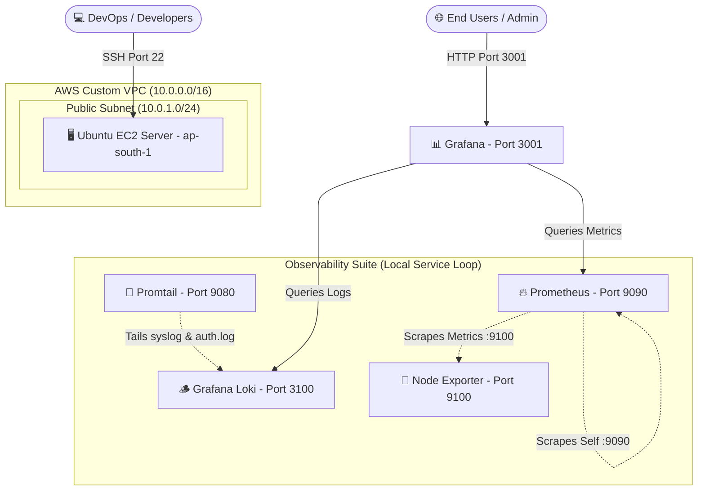
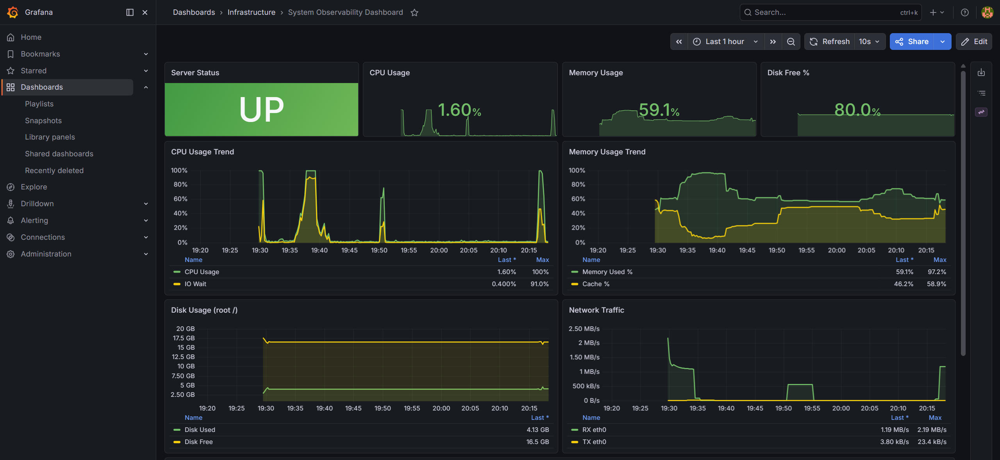

# 🚀 DevOps Monitoring and Deployment Solution

### Course Reference: Ostad DevOps Batch 11 — Assignment Module 8
**Engineer**: Mahmudur Rahman  
**Key Pair Reference**: `ostad_batch_11_mahmud`
**AWS Region**: `ap-south-1`

---

## 📂 1. Directory Structure & Key Artifacts

This repository consolidates all infrastructure provisioning configurations (IaC), observability configurations, automation scripts, and workflows.

Below are the direct references to the key configuration files required for the assignment:

### 🛠️ Infrastructure as Code (IaC)
- **VPC Module Configuration**: [`terraform/modules/vpc/main.tf`](terraform/modules/vpc/main.tf) — Custom VPC, subnets, and gateways.
- **Security Group Configuration**: [`terraform/modules/security-group/main.tf`](terraform/modules/security-group/main.tf) — Security group opening ports `22`, `3001`, `9090`, and `3100`.
- **EC2 Instance Provisioning Module**: [`terraform/modules/ec2/main.tf`](terraform/modules/ec2/main.tf) — Dynamic Ubuntu server creation with GP3 disk encryption.
- **Production Environment Main Orchestrator**: [`terraform/environments/prod/main.tf`](terraform/environments/prod/main.tf) — Main composition file.
- **Production Variables**: [`terraform/environments/prod/variables.tf`](terraform/environments/prod/variables.tf)
- **Production Outputs**: [`terraform/environments/prod/outputs.tf`](terraform/environments/prod/outputs.tf)

### 📈 CI/CD Pipeline
- **Deployment Pipeline Workflow**: [`.github/workflows/deploy.yml`](.github/workflows/deploy.yml) — GitHub Actions pipeline for validation, SSH deployment, and health check retries.

### 📊 Observability Stack & Dashboard Configuration
- **Grafana Dashboard Configuration Model**: [`monitoring/dashboards/system-observability-dashboard.json`](monitoring/dashboards/system-observability-dashboard.json) — Auto-imported dashboard JSON showing system metrics and Loki logs.
- **Prometheus Configuration Scraper**: [`monitoring/prometheus/prometheus.yml`](monitoring/prometheus/prometheus.yml)
- **Loki Log Aggregator Configuration**: [`monitoring/loki/loki-config.yml`](monitoring/loki/loki-config.yml)
- **Promtail Log Shipper Configuration**: [`monitoring/promtail/promtail-config.yml`](monitoring/promtail/promtail-config.yml)
- **Automated Monitoring Setup Script**: [`monitoring/scripts/setup-monitoring.sh`](monitoring/scripts/setup-monitoring.sh)

---

## 📐 2. System Architecture Topology

The architecture provisions a single monitoring and compute server inside a custom VPC. All telemetry components run as native OS-level services managed by `systemd`.



---

## 💻 3. Provisioning Infrastructure (Terraform)

### Step 1: Deploy Infrastructure
1. Navigate to the production environment directory:
   ```bash
   cd terraform/environments/prod
   ```
2. Initialize, validate, and apply the configuration:
   ```bash
   terraform init
   terraform validate
   terraform apply -auto-approve
   ```
3. Note the public IP address output from the console.

---

## 🚀 4. CI/CD Deployment Pipeline (GitHub Actions)

### Secrets Configuration
Go to your GitHub repository under **Settings > Secrets and Variables > Actions > Secrets** and save these 2 repository secrets:

| Secret Name | Value |
|-------------|-------|
| `EC2_SSH_KEY` | Paste the *entire* raw text content of your `ostad_batch_11_mahmud.pem` private key. |
| `EC2_MONITORING_HOST` | The public IP address of the provisioned EC2 server. |

### Triggering Deployments
Push code to the repository on the `main` branch:
```bash
git add .
git commit -m "feat: complete observability stack configuration"
git push origin main
```
The pipeline automatically runs Terraform lint checks, connects to the host via SSH, deploys the stack configurations, and runs the robust liveness test loops.

---

## 📊 5. Observability Stack Details & Port Reference

| Port | Service | Role | Notes |
|---|---|---|---|
| `3001` | Grafana | Visualization UI | Access dashboard via browser |
| `9090` | Prometheus | Metrics Engine | Scrapes Node Exporter and self |
| `3100` | Loki | Log Aggregator | Receives log streams from Promtail |
| `9080` | Promtail | Log Shipper | Ships syslog & auth logs to Loki |
| `9100` | Node Exporter | System Metrics | Exposes CPU, Memory, Disk, Network |

---

## 📸 6. Proof of Solution Working (Evidence Dashboard)

The images below demonstrate that the infrastructure deployment, pipeline execution, system health metrics, and Loki log visualizer are fully operational.

### A. Successful CI/CD Pipeline Execution
Shows the GitHub Actions pipeline successfully completing the Terraform validation, deployment execution, and service health check verification.


### B. Successful Terraform Deployment
Shows the terminal or console output from `terraform apply` confirming successful provisioning of VPC, security group, and EC2 instance.


### C. Grafana Dashboards displaying CPU, Memory, Disk, and Network Metrics
Shows live system utilization stats rendering dynamically on the imported System Observability Dashboard.


### D. Loki Log Visualization
Shows the log stream panel populated with logs routed from `syslog` and `auth.log` using Loki.


---

## 🧹 7. Project Clean Up (Destruction)

To clean up resources and prevent AWS costs after review:
```bash
cd terraform/environments/prod
terraform destroy -auto-approve
```
